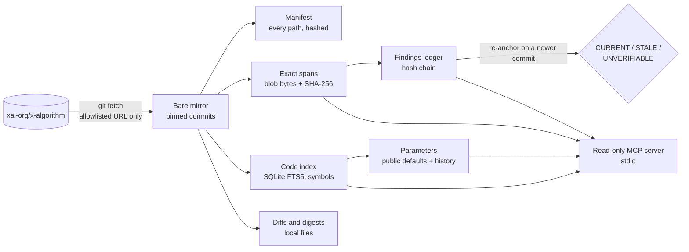

<div align="center">

# TimelineXray

**Read X's open-source recommendation algorithm with receipts.**

Commit-pinned evidence, exact source spans and a findings memory that notices when the code changes,
for people and AI agents studying [`xai-org/x-algorithm`](https://github.com/xai-org/x-algorithm).

[](https://github.com/solisolsoli/timelinexray/actions/workflows/ci.yml)
[](LICENSE)
[](pyproject.toml)
[](pyproject.toml)
[](docs/mcp.md)

[Quickstart](#quickstart) · [Why](#why) · [Features](#features) · [MCP for agents](#use-it-from-an-ai-agent-mcp) · [Docs](#documentation) · [Limits](docs/limits.md)

</div>

Independent community analysis of publicly available source code. Not affiliated with or endorsed by X or xAI.

```console
$ txray param-history ClickWeight        # excerpt
param!      ClickWeight  home-mixer/params/param.rs
  2026-09-26T03:39:02Z  4c5cfe8f07f1  present at the start of the line, public default 0.4
  2026-09-29T03:06:30Z  a707cc27ba36  value changed: public default 0.4 -> 0.3  (old L322 sha256:b01734cae3e1124e at 4c5cfe8f07f1; new L329 sha256:4b5c535dbf7b2b6a)
  current: public default 0.3 at 77d431aabf40 (3 pinned commit(s) with a value)
...
note        values are public defaults at the cited commits, not production values; computed from pinned commits only (nothing fetched)
```

## Why

When the recommendation code behind a large social network is published, most of what gets
written about it is screenshots, paraphrase and threads that go stale with the next commit.
The upstream repository changes often, its commit messages say almost nothing (most read
"Open-source X Recommendation Algorithm"), and the numbers in it are defaults that a
configuration system can override.

TimelineXray makes every statement about that code checkable:

- **Pinned, not moving.** Every answer names a commit. Nothing depends on a branch.
- **Exact bytes.** A citation is a line span read from a git blob, with its SHA-256 and an
  anchor check, so anyone can reproduce it.
- **Findings that expire.** Claims live in a hash-chained ledger; when a newer commit changes
  the cited code, the claim is marked `STALE` instead of quietly staying "true".
- **Honest numbers.** Every value is labelled a *public default at a commit*, never a
  production value or a reach prediction.

## Features

| | |
| --- | --- |
| **One-command setup** | `install.sh` checks Python, SQLite FTS5 and git, then installs `txray`; `txray setup` pins and indexes the tested upstream commit and prints your next commands and the agent connection line. |
| **Snapshots and manifests** | Pin upstream commits into a local bare mirror; classify **every** path (parsed, text, excluded with a reason) with blob ids, sizes, hashes and a license inventory. |
| **Exact spans** | `txray show` reads line ranges from blobs (never a working tree), keeps CRLF and missing final newlines, and reports span and blob SHA-256 plus whether an anchor occurs. |
| **Native code index** | Lexical search, symbols and unresolved call candidates for Rust, Scala, Python and Java on SQLite FTS5: 2,147 files and 50,387 symbols at `77d431a`. |
| **Parameter tools** | `txray param` and `txray param-history` find declarations and their public defaults and trace value changes across pinned commits, both sides cited. |
| **Findings memory** | A hash-chained ledger of claims whose every citation is a byte span; re-anchoring marks changed evidence `STALE`; only a different reviewer can confirm a claim. |
| **Change digests** | `txray diff`, `digest` and `update` classify what changed between two commits from the diff itself (never from commit messages) and list the findings it touches: a short main digest (summary, parameter defaults, registrations, scoring changes, with citations), an appendix with every other item, and the complete JSON. |
| **Read-only MCP server** | Twelve tools over stdio (`search_code`, `read_span`, `find_symbols`, `get_param`, `param_history`, `verify_claim`, ...) so agents cite instead of guess. |
| **Offline creator metrics** | `txray metrics` computes descriptive metrics from *your own* analytics export in a network-disabled process. Never a reach prediction. |
| **Context Layer export** | Optional: write current findings as Markdown notes with permalinks and `[[wikilinks]]` for a [Context Layer](https://github.com/solisolsoli/context-layer) or Obsidian vault. |

Pure standard library at runtime. The only network access is `git fetch` from an allowlisted
upstream URL. No X API, no scraping, no posting, no telemetry.

## Quickstart

Two commands take you from nothing to a cited answer. You need Linux or macOS, Python 3.11+
with SQLite FTS5 (trigram tokenizer) and git 2.38+; the installer checks all three first.

```sh
curl -fsSL https://raw.githubusercontent.com/solisolsoli/timelinexray/main/install.sh | sh
txray setup
```

The installer prints what it found and what it runs (excerpt; it uses `uv` or `pipx` when
present, else a private virtual environment, and never edits your shell files):

```console
$ curl -fsSL https://raw.githubusercontent.com/solisolsoli/timelinexray/main/install.sh | sh
os: Darwin
python: /usr/bin/python3 (3.12.4, SQLite 3.45.3 with FTS5 and the trigram tokenizer)
git: /usr/bin/git (2.54)
method: venv
package: git+https://github.com/solisolsoli/timelinexray@main
...
+ ~/.local/share/timelinexray/venv/bin/python -m pip install --disable-pip-version-check git+https://github.com/solisolsoli/timelinexray@main
+ ln -sf ~/.local/share/timelinexray/venv/bin/txray ~/.local/bin/txray
+ ~/.local/bin/txray --version
txray 0.10.0

TimelineXray is installed. Next step:
  txray setup
```

`txray setup` pins the tested upstream commit (`77d431a`) and builds its code index, once
(excerpt; paths shortened, timings from one laptop):

```console
$ txray setup
commit     77d431aabf409ca1c1eed9bec7e2183f7c914e23
store      ~/.cache/timelinexray
pin        pinned (fetched from the upstream)
index      indexed: 2147 paths, 2140 files with indexed lines, 50387 symbols
elapsed    8.16 s

try next
  txray search 77d431a ClickWeight
  txray param ClickWeight --commit 77d431a
  txray show 77d431a README.md --lines 1-20

connect an agent (prints only; no client configuration is edited)
  claude mcp add --transport stdio timelinexray -- /path/to/bin/txray mcp serve --store /path/to/store
  txray setup --print-mcp-config json   (an mcpServers snippet)

Numbers in the code are public defaults at the pinned commit, not production values.
```

A second `txray setup` fetches and indexes nothing (0.17 s on the same laptop). Then ask
for a cited answer:

```sh
txray show 77d431a home-mixer/params/param.rs --lines 327-331 --anchor ClickWeight
```

```console
commit     77d431aabf409ca1c1eed9bec7e2183f7c914e23
path       home-mixer/params/param.rs
lines      327-331 of 980  (bytes 7900-8053, 153 bytes)
blob       d2bad9d35b39ee11e20dcae58ef496ff860e3fed  sha256 47ad9a0b916049681e2a1561c8e418f2fa6f17f0ad00ea017d3cfa3e5de6ce1b
span       sha256 b923bbcbd2ff34ec1c61bfb2f24354d247ef9f77c914c53b092e4a33885fa8e9
endings    lf=5 crlf=0 unterminated=0
class      parsed-candidate (rust)
anchor     FOUND at line 329 (byte 7919)
note       numbers in the output above are public defaults at commit 77d431aabf409ca1c1eed9bec7e2183f7c914e23, not production values
----
    0.07
);
param!(ClickWeight, f64, "rust_home_mixer_click_weight", 0.3);
param!(OpenLinkWeight, f64, "rust_home_mixer_open_link_weight", 0.2);
param!(
```

Other ways to install (all give the same `txray`; details, options, uninstall and
troubleshooting in [docs/install.md](docs/install.md)):

```sh
uv tool install git+https://github.com/solisolsoli/timelinexray
pipx install git+https://github.com/solisolsoli/timelinexray

# read the script before running it
curl -fsSLO https://raw.githubusercontent.com/solisolsoli/timelinexray/main/install.sh
sh install.sh --dry-run     # prints every command, changes nothing
sh install.sh
```

## How it works



Upstream code is only ever read as data from git objects: never checked out into an agent's
project, never executed, never redistributed. Details: [docs/architecture.md](docs/architecture.md).

## Use it from an AI agent (MCP)

```sh
txray setup --print-mcp-config      # prints the exact `claude mcp add ...` line, absolute paths
```

Run the printed line once; it looks like
`claude mcp add --transport stdio timelinexray -- /path/to/bin/txray mcp serve --store /path/to/store`.
`--print-mcp-config json` prints an `mcpServers` snippet for other stdio clients; neither form
edits any client configuration. See [docs/agents/](docs/agents/) for configuration files and a
short evidence snippet for your `AGENTS.md` / `CLAUDE.md`. The server is read-only, never
fetches, and refuses a store that contains an analytics dataset. Tested so far: Claude Code
2.1.286 (print mode, code tools); every other client is listed as untested in the
[client matrix](docs/mcp.md#client-matrix).

## What it is not, and when not to use it

- **Not a reach predictor or an "algorithm score".** Nothing it computes predicts reach or
  reconstructs a ranking score. The upstream README (at `77d431a`) says many tunable values
  come from a configuration system and experiments run on a share of traffic, so numbers in
  the code are shown as public defaults at a named commit.
- **Not an X API client, scraper, posting bot or engagement automation.** No telemetry.
- **Not a runner of upstream code.** Upstream files are parsed and read as data only.
- **Not a redistribution of upstream source.** The upstream repository is fetched at runtime
  into a local store; this repository contains none of it.

Reach for something else if you want growth tips, a posting schedule or a single score for
a post: TimelineXray answers "what does the public code say, at which commit, in which
bytes", and stops there. Windows is not supported yet, and the parser is lexical (no type
resolution); see [docs/limits.md](docs/limits.md).

## Status

Version `0.10.0`, alpha: all six milestones are implemented (evidence foundation, native code
index, findings memory, read-only MCP server, change digests and offline metrics, release
hardening), plus the fixes of an end-to-end audit. Interfaces may change before 1.0.

Quality is measured, not asserted. `make ci` runs 823 tests against the real upstream, and the CI
workflow runs it on Linux and macOS for Python 3.11, 3.12 and 3.13. The semantic release gate (40 reviewed questions answered by
an agent through the MCP tools, scored by rule) **has not passed yet**: the second live run
(2026-10-02) reached precision 29/31 = 0.935 against a 0.95 threshold, coverage 29/31,
abstention 9/9 and 51/51 intact citations (first run: precision 27/30, abstention 5/9). Revision 2
of the set (`eval/questions-v2.json`, root-reviewed 2026-10-07) corrects the expected answers that
rejected correct replies; its live run (2026-10-07) answered all 31 answer items correctly
(precision 31/32 = 0.969, coverage 31/31, 53/53 intact citations) but missed two of the nine
abstention items (7/9), so the gate still fails; revision 1 and its results are unchanged. The numbers, the analysis and the
next steps are in [docs/release-checklist.md](docs/release-checklist.md#3a-semantic-release-gate-audit-section-6-item-5-p7-sections-71-73).
Every known limit is listed in [docs/limits.md](docs/limits.md).

## Command reference

```sh
# One command after installing: pin + index the tested commit, print next steps
txray setup                      # --latest pins upstream main instead; --no-index pins only
txray setup --print-mcp-config   # prints the `claude mcp add` line (or `json`); changes nothing

# Pin a commit (fetches from the allowlisted upstream only if the commit is not yet local)
txray pin 77d431aabf409ca1c1eed9bec7e2183f7c914e23

# Every path with its classification; --summary for counts and license files
txray manifest 77d431a --summary

# Exact lines 57-60 of a file, with blob and span hashes and an anchor check
txray show 77d431a xai-value-model/scoring.rs --lines 57-60 --anchor "fn apply"

# Only the span bytes, byte for byte
txray show 77d431a xai-value-model/scoring.rs --lines 57-60 --raw

# Native code index for a pinned commit, then search and list symbols
txray index 77d431a --coverage
txray search 77d431a "PhoenixScorer" --path "home-mixer/*" --limit 5
txray symbols 77d431a --name compute_weighted_score

# Parameter declarations with their public default at a commit, and over the pinned commits
txray param ClickWeight --commit 77d431a
txray param-history ClickWeight          # 0.4 -> 0.3 at a707cc2, both sides cited; no fetch

# Read-only MCP server for agents (stdio; see docs/mcp.md and docs/agents/)
txray mcp serve --store ~/.cache/timelinexray --ledger ~/.cache/timelinexray/findings
txray mcp tools --json

# Findings ledger (kept outside any git working tree: --ledger, $TXRAY_FINDINGS or <store>/findings)
txray findings add --actor author-1 --title "..." --claim "..." --evidence-class CODE \
    --status SUPPORTED --cite 77d431a xai-value-model/scoring.rs 65-119 compute_weighted_score
txray findings verify F-...        # span integrity only (INTACT / CHANGED / MISSING)
txray findings reanchor <newer-commit>   # freshness only: CURRENT / STALE / UNVERIFIABLE
txray findings stale               # what to re-review first: old and aligned spans, exact commands
txray findings verify --pin-cited  # pin the commits imported citations name, re-verify, re-anchor
txray findings review F-... --actor reviewer-1 --role reviewer --status SUPPORTED --rationale "..."
txray findings verify-log          # hash chain and HEAD

# Classified changes and a reviewed digest between two pinned commits (nothing is posted)
txray diff   4c5cfe8 a707cc2 --class parameter-default
txray digest 4c5cfe8 a707cc2 --out ~/txray-digests   # main digest + appendix; --ledger DIR for affected findings
txray update --out ~/txray-digests   # guarded fetch + pin + digest; schedule it yourself
txray update --out ~/txray-digests --reanchor --export ~/vault/txray
    # also re-anchors the ledger on the new head and refreshes the notes
    # (docs/updates.md, "Keeping the ledger fresh")

# Offline creator metrics from your own export (network disabled in this process)
txray metrics import export.csv --schema x-post-v1 --lang en --dump-header   # header mapping only: no data row read, nothing written
txray metrics import export.csv --schema x-post-v1 --lang en --out ~/private/txray-metrics \
    --captured-at 2026-09-30T18:00:00+09:00 --counts cumulative --scope combined
txray metrics rwe ~/private/txray-metrics
txray metrics reach ~/private/txray-metrics --horizon 24h
```

`txray digest --out` and `txray export --out` refuse a symbolic link, a missing parent, the
working tree, the snapshot store, the ledger and an analytics dataset as destination.

Analytics datasets are private: keep them outside the snapshot store and version control;
they are never served over MCP. Every metrics output starts with the notice "This is not a
reach prediction."

Every command accepts `--json` for a machine-readable envelope and `--store DIR` to choose
the snapshot store, except that `txray mcp serve` takes `--store`, `--ledger` (default `$TXRAY_FINDINGS`, else
`<store>/findings`) and `--time-budget` but no `--json`, and `txray mcp tools` takes `--json` only.

| Setting | Meaning |
| --- | --- |
| `--store DIR`, `TXRAY_STORE` | Snapshot store location. Default: `$XDG_CACHE_HOME/timelinexray` or `~/.cache/timelinexray`. Keep it outside any agent's project directory. |
| `--upstream URL` | Repository to pin from. Default and only network URL: `https://github.com/xai-org/x-algorithm.git`. |
| `TXRAY_ALLOW_FILE_URLS` | Whitespace-separated `file://` repository URLs that may also be used (local mirrors, tests). Any other scheme here is rejected. |

Exit codes: `0` success; `1` the operation failed (not found, refused, integrity mismatch,
line range past end of file, git failure); `2` invalid arguments; `3` network access refused
by the allowlist.

## Documentation

| Topic | Document |
| --- | --- |
| Installing, options, uninstall, troubleshooting | [docs/install.md](docs/install.md) |
| Design and data flow | [docs/architecture.md](docs/architecture.md) |
| Code index | [docs/code-index.md](docs/code-index.md) |
| MCP server, tools and client matrix | [docs/mcp.md](docs/mcp.md), [docs/agents/](docs/agents/) |
| Findings ledger, re-anchoring, review | [docs/findings-memory.md](docs/findings-memory.md) |
| Diffs, digests and `txray update` | [docs/updates.md](docs/updates.md) |
| Offline metrics from your own export | [docs/analytics.md](docs/analytics.md) |
| Optional Context Layer export | [docs/context-layer.md](docs/context-layer.md) |
| Known limits | [docs/limits.md](docs/limits.md) |
| Release checks and the semantic gate | [docs/release-checklist.md](docs/release-checklist.md) |

## Contributing

```sh
make test   # unittest suite; no test uses the network
make lint   # byte-compile src, tests and scripts; check the CI workflow
make ci     # exactly what CI runs: lint, hygiene, strict tests, build + clean-venv install
```

Tests that need the real upstream use a local clone through a `file://` URL: set
`TXRAY_TEST_UPSTREAM` to a clone containing `77d431a` (`python scripts/fetch_test_upstream.py
DIR` makes one), or place one at `../x-algorithm-upstream`. Without it those tests are
skipped; with it, `make ci` fails if any test is skipped. The build step of `make ci`
downloads `setuptools>=77` from PyPI into an isolated virtual environment; the tool itself
never uses the network except its guarded fetch.

Start with [CONTRIBUTING.md](CONTRIBUTING.md). Contributor and agent rules, including the
evidence contract, are in [AGENTS.md](AGENTS.md) (identical to `CLAUDE.md`). Security
reporting and the threat model are in [SECURITY.md](SECURITY.md).

## Citing

If you use TimelineXray in research or reporting, cite the pinned upstream commit together
with the tool version. GitHub's "Cite this repository" button reads [CITATION.cff](CITATION.cff).

## License

Apache License 2.0 for this project's original code; see [LICENSE](LICENSE) and
[NOTICE](NOTICE). Upstream source is fetched at runtime and remains under its own terms;
the manifest's license inventory records the license and notice files it contains.
